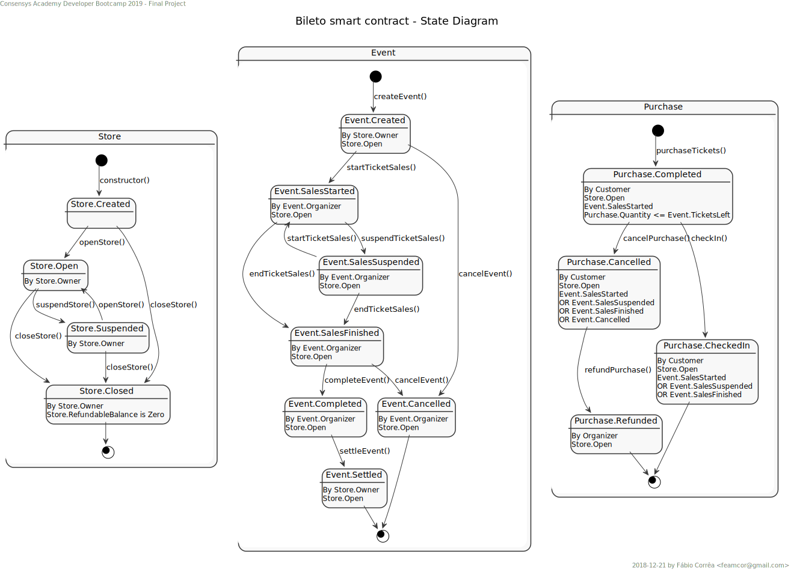

# Bileto

[Bileto](https://en.wiktionary.org/wiki/bileto) is a simple decentralized ticket store on Ethereum.

- [Bileto](#bileto)
  - [Introduction](#introduction)
  - [State Diagram](#state-diagram)
  - [Set-up](#set-up)
  - [Requirements](#requirements)
  - [Enhancements](#enhancements)

## Introduction
TBC

## State Diagram

## Set-up
TBC

## Requirements
TBC

## Enhancements
A list of possible enhancements for this contract are:
- Allow multiple accounts to manage store.
- Allow multiple accounts to manage an event.
- Allow store balance to be distributed to many accounts.
- Allow event balance to be distributed to many accounts.
- Split contract in two:
  - BiletoStore - to be deployed once;
  - BiletoEvent - to be deployed when an event is created.
- Replace store currency from Ether to an utility token.
- etc.
