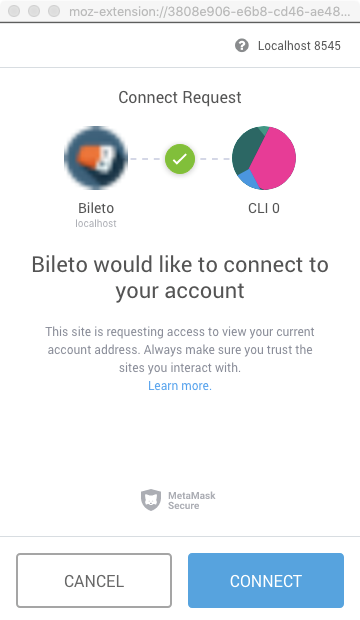
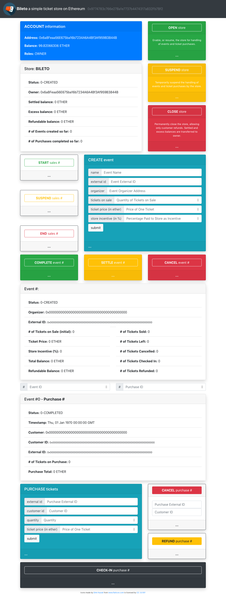

# Bileto

[](https://travis-ci.org/dev-bootcamp-2019/final-project-feamcor)

[Bileto](https://en.wiktionary.org/wiki/bileto) is a simple decentralized online ticket store on Ethereum.

- [Bileto](#bileto)
  - [Introduction](#introduction)
  - [High-level Solution](#high-level-solution)
  - [Installation](#installation)
    - [Installation of the DApp](#installation-of-the-dapp)
    - [Installation of the DApp (production build)](#installation-of-the-dapp-production-build)
    - [Deployment to Rinkeby](#deployment-to-rinkeby)
  - [Enhancements](#enhancements)
  - [Project Specifications](#project-specifications)
  - [Project Requirements](#project-requirements)
    - [User Interface](#user-interface)
    - [Testing](#testing)
    - [Design Patterns](#design-patterns)
    - [Security Tools / Common Attacks](#security-tools--common-attacks)
    - [Use a Library or Extend a Contract](#use-a-library-or-extend-a-contract)
    - [Deployment](#deployment)
    - [Stretch](#stretch)

## Introduction

**Bileto** is a standalone smart contract which implements the business of a simple online ticket store.

It is written in [Solidity](https://solidity.readthedocs.io/en/v0.5.3/index.html) and compiled using `solc` version [0.5.3](https://github.com/ethereum/solidity/releases/tag/v0.5.3).

It can be deployed to an [Ethereum](https://ethereum.org) blockchain, be it the public [mainnet](https://etherscan.io), a public testnet like [Rinkeby](https://rinkeby.etherscan.io), a private blockchain, or on a local development blockchain like [Ganache](https://truffleframework.com/ganache).

As currency for ticket purchases, it uses Ethereum's native [Ether](https://www.ethereum.org/ether).

**Bileto** was developed as [my](https://github.com/feamcor) final project for the [ConsenSys Academy Developer Program Bootcamp](https://consensys.net/academy/bootcamp), cohort of [October 29th, 2018](https://courses.consensys.net/courses/course-v1:ConsenSysAcademy+2018DP+2/about), and it also provides a simple [web3](https://blockchainhub.net/web3-decentralized-web)-enabled web application ([DApp](https://ethereum.stackexchange.com/questions/383/what-is-a-dapp)) for trying its functionalities.

## High-level Solution

The **Bileto** contract manages a few entities:

- **Store** - one per deployed contract. A store has an owner which in essence is the [EOA](https://ethereum.stackexchange.com/questions/5828/what-is-an-eoa-account) who deployed the contract. Only the owner can withdraw store's funds. Only owner can open, suspend ([circuit breaker](https://github.com/ConsenSys/smart-contract-best-practices/blob/master/docs/software_engineering.md#circuit-breakers-pause-contract-functionality)) and close the store. Closing a store is a final status that cannot be reversed. A store cannot be closed while there are pending refundable balance (to be paid back to customers due to purchase or event cancellations);
- **Event** - many events can be created per store. An event has an organizer which is an EOA set during event creation. Event organizer will receive (withdraw) event's funds when event is completed. Organizer can start, suspend (circuit breaker) or finish ticket sales for his/her event. Organizer can also cancel the event;
- **Purchase** - many purchases can be performed per event (limited to the quantity of tickets available for sale). A purchase is always related to one event. If a customer wants to buy tickets, for instance, of two distinct events, he/she has to perform, at least, two purchases, one for each event. Customer can purchase one or more tickets on a single purchase. A purchase can be cancelled by customer while event is not completed, or by organizer when an event is cancelled. These cancellations give the right to the customer to be refunded (has to be requested by customer only).

A **check-in** status is set when customer actually attends to the event, making use of the tickets that he/she purchased previously.

The diagram below depicts the state transition and main pre-conditions handled by the contract for its entities.


## Installation

The source code of Bileto can be found at [GitHub](https://github.com/dev-bootcamp-2019/final-project-feamcor).

1. The following instructions assume that you are using a \*nix-like OS (e.g. Linux, macOS etc.) from its command-line and that [Git](https://git-scm.com/) is already installed.
2. Download and install the latest Node.js release for your OS according to the instructions found at https://nodejs.org.
   - Avoid installing Node.js with `sudo` in order to avoid priviledge issues later on when installing packages and dependencies.
   - On macOS, preferrably install it using the Homebrew package manager found on https://brew.sh.
3. Install Truffle.
   - For more information, follow the instructions found at https://truffleframework.com/docs/truffle/getting-started/installation.

```bash
$ npm install truffle -g
```

4. Install Ganache CLI.
   - For more information, follow the instructions found at https://truffleframework.com/docs/ganache/quickstart.

```bash
$ npm install ganache-cli -g
```

5. Go to a directory of your preference in your computer (e.g. `~/Desktop`).
6. Download or clone Bileto repo to your computer.

```bash
$ git clone https://github.com/dev-bootcamp-2019/final-project-feamcor.git
```

7. Go to the new directory.

```bash
$ cd final-project-feamcor
```

8. The structure of directories will be as below.

```
.
└── bileto
    ├── client
    │   ├── public
    │   └── src
    ├── contracts
    ├── migrations
    └── test
```

9. Go to the `bileto` directory for accessing the Bileto smart contract and its corresponding Truffle project files.

```bash
$ cd bileto
```

10. Rename `.env_template` file, present in the directory, to `.env`.
11. The `truffle-config.js` is configured for the following networks:

- `development` and `ganachecli` using port 8545;
- `ganachegui` using port 7545;
- `rinkeby` using Infura services.

12. In order to use `rinkeby`, edit the `.env` file, changing the variables `INFURA_PROJECT_ID`, `WALLET_SEED_PHRASE`, `RINKEBY_ADDRESS_INDEX` and `RINKEBY_NUM_ADDRESSES` with the required values.

13. Install the project dependencies.

```bash
$ npm install
```

14. Compile Bileto and its companion smart contracts.

```bash
$ truffle compile
```

15. You should see similar output as below.

```
Compiling ./contracts/Address.sol...
Compiling ./contracts/Bileto.sol...
Compiling ./contracts/Counter.sol...
Compiling ./contracts/Migrations.sol...
Compiling ./contracts/Ownable.sol...
Compiling ./contracts/ReentrancyGuard.sol...
Compiling ./contracts/SafeMath.sol...
Writing artifacts to ./build/contracts
```

16. Open another terminal window, go to the same directory `final-project-feamcor/bileto` and run Ganache CLI.

```bash
$ ganache-cli
```

17. You should see similar output as below.

```
Ganache CLI v6.2.5 (ganache-core: 2.3.3)

Available Accounts
==================
(0) 0x6a8feaa56e675ba16b7234a6a4bf3af959b3844b (~100 ETH)
(1) 0xb1f86f840640fdcc302e849dfa126547a0239a5d (~100 ETH)
(2) 0x6708365569b57ff513122631e582d92813c7b32f (~100 ETH)
(3) 0x4980025f8deccd8d20ba62f4d8762270b15ec1d4 (~100 ETH)
(4) 0xfa94b34f930a81c9aff1ebd69f647a034c51491d (~100 ETH)
(5) 0xa658a738c9e291686ef9bec0422148cd00424f4a (~100 ETH)
(6) 0x777f185895fc7108932e761854b1cf3dc30da02d (~100 ETH)
(7) 0x919286bdd7543720af649ca80d01244c34c51fec (~100 ETH)
(8) 0x86ef9cd0536b7b0b75e2ee3aee20545c4cfb1912 (~100 ETH)
(9) 0x291e32bfe284a244ee01ca3dd4620db39ff452d9 (~100 ETH)

Private Keys
==================
(0) 0x222ac7993d645b2d01047c11931ab8b9ae500ef9b622e735d499d96a119a5092
(1) 0x5c2da5306ad390ce4f89caa5b4b78eb6823a996689b9478f961bd495ba55f351
(2) 0x0f41012153ffcc4eb6883d3b997fc9d1f66a70a2bafcba6caee4f127cb5e768e
(3) 0xd73de38722ca90d47138e27066f0e9e9725fbc326a59e04b6433d34aaf028496
(4) 0x4b03fdecd3b5b3c4168d6d2b8869c805181be124fc6f41a4d65d6770949e7780
(5) 0xf5499448c3b9e438c35cd916f99e673099905a5699a564e03213aba1de954b69
(6) 0xe5dd6bffb00d3a510b38f0faae4010f80fd3a03190affe415b7d5c5aed1be1c5
(7) 0xaafa29cebcd78c2b3c1edb6ec6d5802c4566be7f6fc9dd4136730df6fab820e8
(8) 0xa650b4470c7423580ab770a0b9103f1b9d2f5e49d6931dcf1cfb418d38fade91
(9) 0x2041eae18eaef42f999f57edcf7b1ef9d84932212e8e4d300d234422cee2b0c5

HD Wallet
==================
Mnemonic:      gallery fee stadium abstract narrow scene account loyal immense trend cinnamon final
Base HD Path:  m/44'/60'/0'/0/{account_index}

Gas Price
==================
20000000000

Gas Limit
==================
6721975

Listening on 127.0.0.1:8545
```

18. Keep the current terminal window open and switch back to the first terminal window.
19. Migrate (deploy) Bileto to Ganache CLI.

```bash
$ truffle migrate
```

20. You should see similar output as below.

```
Starting migrations...
======================
> Network name:    'development'
> Network id:      1548661854443
> Block gas limit: 6721975


2_deploy_contracts.js
=====================

   Deploying 'Bileto'
   ------------------
   > transaction hash:    0x31da26f35f6efa10eb2510aa418a30880d48f393bde79686c6e9473306f34406
   > Blocks: 0            Seconds: 0
   > contract address:    0x9774783c766e27Ba1e7737b4474317a832Fb7Bf2
   > account:             0x6a8Feaa56E675ba16b7234A6A4Bf3Af959B3844B
   > balance:             99.89264496
   > gas used:            5104652
   > gas price:           20 gwei
   > value sent:          0 ETH
   > total cost:          0.10209304 ETH


   > Saving migration to chain.
   > Saving artifacts
   -------------------------------------
   > Total cost:          0.10209304 ETH


Summary
=======
> Total deployments:   1
> Final cost:          0.10209304 ETH
```

21. Run the test script.

```bash
$ truffle test
```

22. You should see similar output as below.

```
Using network 'development'.

  Contract: Bileto
    ✓ owner should create store
    ✓ non-owner should not open store (61ms)
    ✓ owner should open store (80ms)
    ✓ non-owner should not suspend opened store (58ms)
    ✓ owner should suspend opened store (79ms)
    ✓ owner should re-open suspended store (80ms)
    ✓ non-owner should not create an event (89ms)
    ✓ owner should not create an event when organizer is a contract (58ms)
    ✓ owner should not create an event without external ID (56ms)
    ✓ owner should not create an event without name (107ms)
    ✓ owner should not create an event with incentive greater than 100% (63ms)
    ✓ owner should not create an event with no tickets available for sale (62ms)
    ✓ owner should create an event (113ms)
    ✓ contract should store event basic info accordingly
    ✓ contract should init event sales info accordingly
    ✓ customer should not complete purchase when sales not started yet (60ms)
    ✓ organizer should start ticket sales of event (59ms)
    ✓ customer should not complete purchase when quantity is zero (46ms)
    ✓ customer should not complete purchase when there are not enough tickets (38ms)
    ✓ customer should not complete purchase without external ID (44ms)
    ✓ customer should not complete purchase without timestamp (47ms)
    ✓ customer should not complete purchase without customer ID (39ms)
    ✓ customer should not complete purchase when value less than total (51ms)
    ✓ customer should not complete purchase when value more than total (44ms)
    ✓ customer should complete 1st purchase (95ms)
    ✓ contract should store purchase info accordingly
    ✓ customer should cancel a purchase (80ms)
    ✓ organizer should suspend ticket sales of an event (64ms)
    ✓ organizer should refund a cancelled purchase (72ms)
    ✓ organizer should resume ticket sales of a suspended event (56ms)
    ✓ customer should complete 2nd purchase (106ms)
    ✓ customer should complete 3rd purchase (98ms)
    ✓ organizer should end ticket sales of an event (58ms)
    ✓ contract should not check-in invalid customer (43ms)
    ✓ contract should not check-in invalid purchase (52ms)
    ✓ contract should check-in customer (62ms)
    ✓ organizer should complete an event (60ms)
    ✓ owner should settle an event (64ms)
    ✓ organizer should not be able to cancel a settled event (56ms)
    ✓ non-owner should not close store (44ms)
    ✓ owner should close store (61ms)

  41 passing (4s)
```

23. **Congratulations!** You have the Bileto smart contract running on your machine. This is a typical set-up for development and testing.

### Installation of the DApp

1. Continuing from the previous section, keep your terminal windows opened and ganache running.
2. For running the DApp you will need MetaMask to be installed.

   - It works with Chrome and Firefox.
   - Follow the instructions found at https://metamask.io to install the plugin.
   - Configure MetaMask by importing the seed phrase (mnemonic) generated by Ganache CLI on step 16.

3. Go to the `client` directory.

```bash
$ cd client
```

3. Install the project dependencies.

```bash
$ npm install
```

4. Run the DApp using the development server provided by React.

```bash
$ npm start
```

5. You should see similar output as below. Also, your default browser should open on the URL listed below.

```
Compiled successfully!

You can now view bileto-client in the browser.

  Local:            http://localhost:3000/
  On Your Network:  http://10.0.1.8:3000/

Note that the development build is not optimized.
To create a production build, use npm run build.
```

6. MetaMask should ask for authorization to connect the DApp to your account. Press `connect` to proceed.



7. The Bileto DApp is loaded and ready to be used.



8. **Congratulations!** Now you can use the Bileto DApp to operate the ticket store. You should have at least 3 accounts in MetaMask in order to play with the different roles that an account assume: store owner, event organizer and customer. Enjoy!

### Installation of the DApp (production build)

1. The steps above enabled the development build of the DApp.
2. For production environments, you should use a production build where the app is packaged and optimized.
3. To generate the production build, run the command below.

```bash
$ npm run build
```

4. You should see similar output as below.

```
> bileto-client@0.1.0 build /Users/feamcor/Desktop/final-project-feamcor/bileto/client
> react-scripts build

Creating an optimized production build...
Compiled successfully.

File sizes after gzip:

  332.38 KB  build/static/js/1.2c8ff09c.chunk.js
  114.36 KB  build/static/js/main.c835e9c2.chunk.js
  21.85 KB   build/static/css/1.49a785b6.chunk.css
  763 B      build/static/js/runtime~main.229c360f.js

The project was built assuming it is hosted at the server root.
You can control this with the homepage field in your package.json.
For example, add this to build it for GitHub Pages:

  "homepage" : "http://myname.github.io/myapp",

The build folder is ready to be deployed.
You may serve it with a static server:

  serve -s build

Find out more about deployment here:

  http://bit.ly/CRA-deploy

```

5. For running the production build, first you need to install a static server.

```bash
$ npm install serve -g
```

6. And then you can run the static server using your production build.

```bash
$ serve -s build
```

7. You should see similar output as below.

```
   ┌───────────────────────────────────────────────┐
   │                                               │
   │   Serving!                                    │
   │                                               │
   │   - Local:            http://localhost:5000   │
   │   - On Your Network:  http://10.0.1.8:5000    │
   │                                               │
   │   Copied local address to clipboard!          │
   │                                               │
   └───────────────────────────────────────────────┘
```

8. To interrupt the server, press `ctrl-c`.
9. **Congratulations!** Now you can use the production build of the Bileto DApp to operate the ticket store. Enjoy!

---

### Deployment to Rinkeby

- Bileto is deployed to Rinkeby testnet.
- Below you have the output of `truffle migrate --network rinkeby`.

```
Starting migrations...
======================
> Network name:    'rinkeby'
> Network id:      4
> Block gas limit: 7004702


1_initial_migration.js
======================

   Deploying 'Migrations'
   ----------------------
   > transaction hash:    0xf2ead09c0efc25f74bbdccaf98614cb1f15ffbc2f473ecb20b07edd4fc296950
   > Blocks: 0            Seconds: 5
   > contract address:    0x7838d7fb7Bba8009C5384c2929F98e50ff76E397
   > account:             0xF1BD9268d37D9dbc748b8D0a8556F72d1b331E02
   > balance:             1.092280984
   > gas used:            221171
   > gas price:           20 gwei
   > value sent:          0 ETH
   > total cost:          0.00442342 ETH


   > Saving migration to chain.
   > Saving artifacts
   -------------------------------------
   > Total cost:          0.00442342 ETH


2_deploy_contracts.js
=====================

   Deploying 'Bileto'
   ------------------
   > transaction hash:    0x8e2be04f12363150f8e4e995bd50c29cfb9ea82827025d89b52075c2246ffb82
   > Blocks: 0            Seconds: 8
   > contract address:    0x2821dc1805f63824f6C5C5486786C923860e26AB
   > account:             0xF1BD9268d37D9dbc748b8D0a8556F72d1b331E02
   > balance:             0.989444084
   > gas used:            5099916
   > gas price:           20 gwei
   > value sent:          0 ETH
   > total cost:          0.10199832 ETH


   > Saving migration to chain.
   > Saving artifacts
   -------------------------------------
   > Total cost:          0.10199832 ETH


Summary
=======
> Total deployments:   2
> Final cost:          0.10642174 ETH
```

- Click [here](https://rinkeby.etherscan.io/tx/0x8e2be04f12363150f8e4e995bd50c29cfb9ea82827025d89b52075c2246ffb82) to view the transaction information on [Etherscan](https://rinkeby.etherscan.io).
- Click [here](https://rinkeby.etherscan.io/address/0x2821dc1805f63824f6C5C5486786C923860e26AB) to view contract information on [Etherscan](https://rinkeby.etherscan.io).

---

## Enhancements

A list of possible enhancements for this contract are:

- Allow different kinds of tickets, with distinct prices.
- Allow to increase or decrease number of tickets available for sale.
- Allow multiple accounts to manage the store subject to multi-sig protocol.
- Allow multiple accounts to manage an event subject to multi-sig protocol.
- Allow store balance to be distributed to many accounts.
- Allow event balance to be distributed to many accounts.
- Split contract into:
  - _BiletoStore_ - to be deployed once;
  - _BiletoEvent_ - to be deployed whenever an event is created.
- Replace store currency from Ether to a utility token.
- Integrate customer identification with uPort or other sovereign identity provider.
- Turn individual tickets into [ERC-721](https://eips.ethereum.org/EIPS/eip-721) NFT deeds.
- _etc._

---

## Project Specifications

- [x] A README.md that explains the project
  - [x] What does it do?
  - [x] How to set it up.
    - [x] How to run a local development server.
- [x] It should be a [Truffle project](https://truffleframework.com/docs/truffle/getting-started/creating-a-project).
  - [x] All contracts should be in a `contracts` directory.
    - [x] `truffle compile` should successfully compile contracts.
  - [x] Migration contract and migration scripts should work.
    - [x] `truffle migrate` should successfully migrate contracts to a locally running `ganache-cli` test blockchain on port `8454`.
  - [x] All tests should be in a `tests` directory.
    - [x] `truffle test` should migrate contracts and run the tests.
- [x] Smart contract code should be commented according to the [specs in the documentation](https://solidity.readthedocs.io/en/v0.5.2/layout-of-source-files.html#comments).
- [x] Create at least 5 tests for each smart contract.
  - [ ] Write a sentence or two explaining what the tests are covering, and explain why those tests were written.
- [x] A development server to serve the front-end interface of the application.
  - [x] It can be something as simple as the [lite-server](https://www.npmjs.com/package/lite-server) used in the [Truffle Pet Shop tutorial](https://truffleframework.com/tutorials/pet-shop).
- [x] A document [design_pattern_decisions.md](design_pattern_decisions.md) that explains the design patterns chosen.
- [x] A document [avoiding_common_attacks.md](avoiding_common_attacks.md) that explains what measures were taken to ensure that the contracts are not susceptible to common attacks.
- [x] Implement/use a library or an EthPM package.
  - [ ] If the project does not require a library or an EthPM package, demonstrate how it would do that in a contract called `LibraryDemo.sol`.
- [ ] Develop your application and run the other projects during evaluation in a VirtualBox VM running Ubuntu 16.04 to reduce the chances of runtime environment variables.

---

## Project Requirements

### User Interface

- [x] Run the dapp on a development server locally for testing and grading.
- [x] You should be able to visit a URL and interact with the application:
  - [x] App recognizes current account;
  - [x] Sign transactions using MetaMask or uPort;
  - [x] Contract state is updated;
  - [x] Update reflected in UI.

### Testing

- [x] Write 5 tests for each contract you wrote;
  - [x] Solidity **or** JavaScript.
- [x] Explain why you wrote those tests;
  - [x] Tests run with `truffle test`.

### Design Patterns

- [x] Implement a circuit breaker (emergency stop) pattern.
- [x] What other design patterns have you used / not used?
  - [x] Why did you choose the patterns that you did?
  - [ ] Why not others?

### Security Tools / Common Attacks

- [x] Explain what measures you have taken to ensure that your contracts are not susceptible to common attacks.

### Use a Library or Extend a Contract

- [x] Via EthPM or write your own.

### Deployment

- [x] Deploy your application onto one of the test networks.
- [x] Include a document called [deployed_addresses.txt](deployed_addresses.txt) that describes where your contracts live (which testnet and address).
- [x] Students can verify their source code using Etherscan https://etherscan.io/verifyContract for the appropriate testnet.
- [x] Evaluators can check by getting the provided contract ABI and calling a function on the deployed contract at https://www.myetherwallet.com/#contracts or checking the verification on Etherscan.

### Stretch

- [ ] Implement an upgradable design pattern.
- [ ] Write a smart contract in LLL or Vyper.
- [ ] Integrate with an additional service. For example:
  - [ ] IPFS - users can dynamically upload documents to IPFS that are referenced via their smart contract.
  - [ ] uPort
  - [ ] Ethereum Name Service - a name registered on the ENS resolves to the contract, verifiable on `https://rinkeby.etherscan.io/<contract_name>`
  - [ ] Oracle
